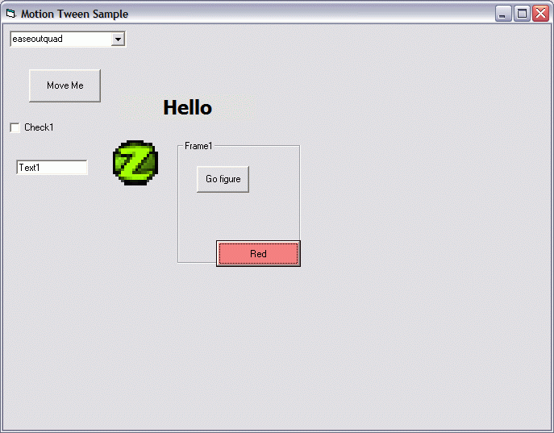



## Motion Tweening in VB6

### Description

This code provides a way to smoothly tween a control from one location to another, much like Flash's ability to use motion tweens using keyframes.

Portions of the code was ported from the C# motion class project --&gt; http://www.codeproject.com/csharp/tweencs.asp

After playing around with the C# version, I decided to port it into VB for the benefit of VB6 programmers. :)
 
### More Info
 

             |
---                |---
**Submitted On**   |2006-01-14 20:40:02
**By**             |[Remerico Cruz](https://github.com/Planet-Source-Code/PSCIndex/blob/master/ByAuthor/remerico-cruz.md)
**Level**          |Intermediate
**User Rating**    |5.0 (10 globes from 2 users)
**Compatibility**  |VB 6\.0
**Category**       |[Miscellaneous](https://github.com/Planet-Source-Code/PSCIndex/blob/master/ByCategory/miscellaneous__1-1.md)
**World**          |[Visual Basic](https://github.com/Planet-Source-Code/PSCIndex/blob/master/ByWorld/visual-basic.md)
**Archive File**   |[Motion\_Twe1965201142006\.zip](https://github.com/Planet-Source-Code/remerico-cruz-motion-tweening-in-vb6__1-64021/archive/master.zip)

